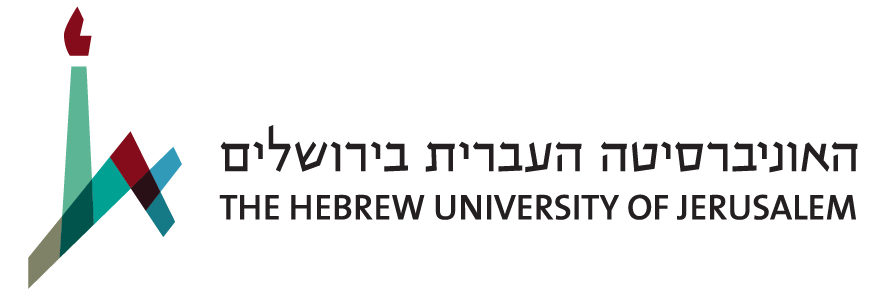

# Ron Sarafian

Ph.D. student at Dept. of Industrial Engineering at Ben Gurion University.

Supervised by [Dr Jonathan Rosenblatt](http://www.john-ros.com/) and [Prof Itai Kloog](http://in.bgu.ac.il/en/humsos/geog/Pages/staff/kloog.aspx). 

My research focuses on statistical and machine learning algorithms and their application in geographical and environmental fields.

I am interested in solving both theoretical and real-world problems related to:

- Spatio-temporal data analysis
- Remote sensing based prediction 
- Multivariate statistics
- Distributed Machine Learning

## Projects

check my [Github page](https://github.com/ronsarafian) for projects in progress.

More cool stuff including some tutorials i wrote can be found in my [Rpub page](http://rpubs.com/ronsar)

## Education

<table border="0">
                </tr>-->
                <tr class="table_item">
                    <td class="table_date">2017 - Now</td>
                    <td class="table_title">Ph.D. student, Ben-Gurion University of the Negev, Department of Industrial Engineering</td>
                    <td rowspan="2" class="table_img"></td>
                </tr>
                <tr class="table_item">
                    <td class="table_date">2014 - 2016</td>
                    <td class="table_title">MA. Economics (expertise in applied econometrics), The Hebrew University of Jerusalem</td>
                    <td rowspan="2" class="table_img"></td>
                </tr>
                <tr>
                    <td>&nbsp;</td>
                    <td class="table_desc">Thesis: Empirical estimation of government R&D policy with Machine Learning tools.</td>
                </tr>
                <tr>
                    <td>&nbsp;</td>
                    <td class="table_desc">Advisor: Prof Shaol Lach</td>
                </tr>
                <tr class="table_item">
                    <td class="table_date">2011 - 2014</td>
                    <td class="table_title">BA. Economics, Ben-Gurion University of the Negev</td>
                    <td rowspan="2" class="table_img"></td>
                </tr>
                <tr>
                    <td>&nbsp;</td>
                    <td class="table_desc">(summa cum laude)</td>
                </tr>
</table>

# Education

2017 - Now $\ \quad$ Ph.D. student, Ben-Gurion University of the Negev

2014 - 2016 $\quad$  MA. Economics, expertise in applied econometrics, The Hebrew University of Jerusalem
  
  $\quad$ - Thesis: Empirical estimation of government R&D policy with Machine Learning tools.
  $\quad$ - Advisor: Prof Shaol Lach

2011 - 2014 $\quad$ BA. Economics (summa cum laude), Ben-Gurion University of the Negev

## Work Experience

2016 - 2017 $\quad$ Freelance, R programing and statistical consultation.

2014 - 2016 $\quad$ Data analysit, Research Unit, Israel Innovation Authority.

2012 - 2014 $\quad$ Teaching Assistant, Statistics, Ben-Gurion University of the Negev

