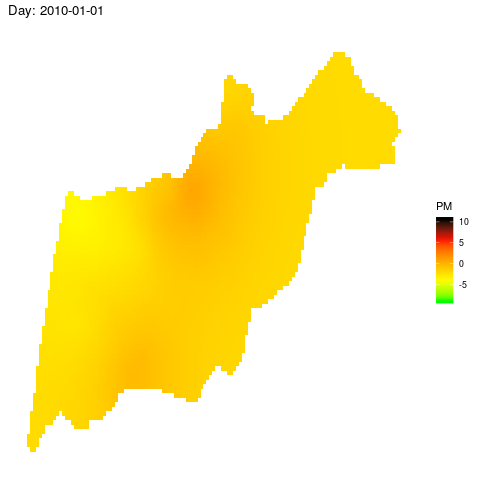

# Ron Sarafian

Ph.D. student at Dept. of Industrial Engineering at Ben Gurion University.

Supervised by [Dr Jonathan Rosenblatt](http://www.john-ros.com/) and [Prof Itai Kloog](http://in.bgu.ac.il/en/humsos/geog/Pages/staff/kloog.aspx). 

My research focuses on statistical and machine learning algorithms and their application in geographical and environmental fields.

I am interested in solving both theoretical and real-world problems related to:

- Spatio-temporal data
- Remote sensing based prediction 
- Multivariate statistics
- Distributed machine learning
- Deep learning in Geography

## Featured Projects

### Spatio-temporal satellite-based air pollution prediction

Studying the effects of air-pollution on health is a key area in environmental epidemiology. An accurate estimation of air-pollution effects requires spatio-temporally resolved datasets of air-pollution, especially, Fine \emph{Particulate Matter} (PM). Satellite-based technology has greatly enhanced the ability to provide PM assessments in locations where direct measurement is impossible using Machine learning algorithms.

### Cross-validation and Estimation of machine learning algorithms in spatio-temporally dependent data

Most model validation techniques, such as cross-validation (CV), require independence between train and test sets. Ignoring dependencies will result in over-optimistic error estimates, thus favoring  more complex models. In spatio-temporal analysis, such dependencies are to be expected, so that CV may return biased error estimates. Moreover, sometimes one wants to estimate a machine learning algorithem performance over a certain spatio-temporal distribution, while the learner was trained on a dataset drawn from different time-space distribution. This might be a common problem in environmental or geographical problems where data usually has some sort of spatially-clumped distribution.

## Teaching

[Introduction to Data Science](https://bookdown.org/ronsarafian/IntrotoDS/): I am teaching this course at Ben-Gurion University. This is an introductory-level, hands-on focused course, designed for students with basic background in statistics and econometrics, and without programming experience. It introduces students to different tools needed for building a data science pipeline, including data processing, analysis, visualization and modeling. The course is taught in R environment.

## Publications

Sarafian, R, Kloog, I, Just,A, Rosenblatt, J.D, 2019. Gaussian Markov Random Fields versus Linear Mixed Models for satellite-based PM2.5 assessment: Evidence from the Northeastern USA. *Atmospheric Environment*

